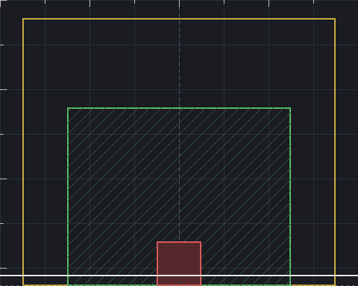

# 건물 그림 규격 (집 · 상점)

`building_guide.png`가 도면이다. **512 x 410**으로 열고 그 위에 그리면 자리가 맞는다.



## 한눈에

| | 값 |
| --- | --- |
| 캔버스 | **512 x 410** |
| 게임에서 그리는 배율 | **0.5배** (화면에서 256 x 205) |
| 게임 한 칸 | 아트 **64px** → 캔버스는 8칸 x 6.4칸 |
| 파일 자리 | `game/assets/sprites/` |
| 파일 이름 | 살림집 `house.png` · 가게 `house_<부지 id>.png` |

부지 id는 여덟 가지다 — `post` `general` `lab` `smith` `ranch` `inn` `library` `fish`.
없으면 `house.png`로 떨어지므로, 하나만 먼저 그려도 게임은 안 깨진다.

## 도면의 색이 뜻하는 것

### 초록 — 발자국 5 x 4칸 (아트 96,154 ~ 416,410)

건물이 **실제로 차지하는 칸**이다. 이 안은 전부 막혀서 걸어 들어갈 수 없다.
벽은 여기 안쪽에 그린다.

### 노랑 — 막히는 한계선 (아트 32,26 ~ 480,410)

지붕처럼 발자국 밖으로 나오는 부분도 여기까지는 막아 준다.
**이 선 밖으로 삐져나온 그림은 그냥 통과된다** — 지붕 끝이 허공에 뜬 것처럼
보이고 주인공이 그 위를 걸어간다. 실루엣을 이 안에 넣을 것.

**그리고 이 상자를 꽉 채워야 한다.** 448 x 384라 비율이 **1.17 : 1**이다.
집을 이보다 옆으로 넓게 그리면 가로에 맞추느라 배율이 깎여서, 세로가
남는데도 건물이 작아진다. 옆집보다 유독 낮아 보이면 십중팔구 이 이유다.

| 원본 비율 (가로:세로) | 들어가는 크기 | |
| --- | --- | --- |
| 1.17 : 1 | 448 x 384 | 딱 맞는다 |
| 1.25 : 1 | 448 x 358 | 괜찮다 |
| 1.5 : 1 | 448 x 299 | 낮아 보인다 |
| 1.0 : 1 | 384 x 384 | 홀쭉해 보인다 |

큰 종이에 그리더라도 **지붕 끝~지붕 끝의 가로가 세로의 1.2배쯤**이 되게.
1536폭으로 그린다면 처마 밑 그림자까지 세로 1250~1350은 나와야 한다.

### 빨강 — 문 칸 (아트 224,346 ~ 288,410)

문은 **반드시 여기 가운데**여야 한다. 게임이 이 칸을 「문」으로 알고 있어서,
주인공이 이 칸을 밟으면 그대로 안으로 들어간다. 그림의 문이 다른 자리에
있으면 **벽으로 걸어 들어가는 것처럼 보인다.**

- 가로 중심: 아트 **x = 256** (캔버스 정가운데)
- 문 폭: 64~72px 권장 (딱 한 칸 ~ 조금 넓게)
- 문 아래끝: 아트 **y = 394** 근처 (땅 선)

### 흰 선 — 땅에 닿는 선 (아트 y = 394)

벽 밑동이 여기다. 그 아래 15px(y 395~409)는 **바닥 그림자** 자리로 비워 둔다.
그림자가 있어야 건물이 땅에 붙어 보인다.

## 지금 어디까지 됐나

| 파일 | 그림 |
| --- | --- |
| `house.png` (우리집) | 손그림 (`ref_house.png`) |
| `house_general.png` (잡화점) | 손그림 (`ref_shop.png`) |
| 나머지 여섯 (`post` `lab` `smith` `ranch` `inn` `library` `fish`) | `make_house.js`가 그린 것 |

**둘과 여섯은 그림체가 다르다.** 손그림 쪽이 결·소품·빛이 훨씬 촘촘해서,
한 화면에 같이 들어오면 예전 것이 납작해 보인다. 마을 전체를 손그림으로
바꾸는 게 맞고, 그때까지는 섞여 보이는 게 정상이다.

## 그림체 맞추기

바닥 타일이 참고 그림에서 오려 온 것이라, 건물만 매끈하면 혼자 튄다.
`make_house.js`가 쓰는 규칙을 그대로 따르면 된다 (자세한 것은 `village.md`):

- **회벽은 크림색이 아니라 차가운 흰빛** `#e2e2d6`. 노란기가 돌면 떠 보인다.
- 기와는 진한 주황 `#ce702e`, 나무 `#7a542e`, 돌 `#b0b0a8`, 창유리 짙은 남빛 `#46708c`
- 넓은 면은 단색으로 두지 말 것. `assets/ref/mat/grain_*.png`의 결을 얹는다
  (밝은 쪽은 조금 따뜻하게, 그늘은 조금 차갑게)
- 색은 6단계로 끊는다. 너무 곱게 두면 도트로 안 보인다.

### 깊이는 벡터 하나로

평면으로 보이지 않게 하는 요령이다. 앞면을 **D = (+86, -34)** 만큼 밀면 뒷면이고,
그 사이가 옆벽과 지붕면이다 (512 기준으로는 (+69, -27)).
여기에 처마 그늘 · 창턱 아래 그림자 · 문 안쪽 어둠 · 옆벽 한 톤 어둡게를 얹으면
종이를 오려 세운 느낌이 사라진다.

## 게임에 넣기

큰 그림(예: 1536 x 1024 잘라낸 PNG)을 그대로 주면 `assets/ref/cut_house.js`가
규격에 앉혀 준다. 원본을 `assets/ref/src/`에 두고 표에 한 줄 적으면 된다:

```js
{ src: 'ref_shop.png', out: 'house_general', door: 768, sky: { x0: 1000, y1: 185 } },
```

- `door` — 원본에서 **문 한가운데 x**. 이걸 캔버스 x=256에 맞춘다.
  자동으로 찾으면 현관 기둥이나 덧창의 나무색을 문으로 착각해서 손으로 잰다.
- `sky` — 굴뚝 **연기**처럼 위로 길게 뻗은 부분을 지울 범위. 연기를 남기면
  그만큼 실루엣이 높아져서 배율이 깎이고 집이 작아진다.

스크립트가 하는 일은 셋이다 — 실루엣을 한계선 안에 넣고, 문을 x=256에
세우고, 밑동을 땅 선에 올린다. 색 계단 6도 여기서 끊는다.

```
node assets/ref/cut_house.js
godot --headless --path game --import
```

손으로 512 x 410에 직접 그렸다면 `assets/sprites/house_<id>.png`로 넣기만
하면 된다. `main.gd`의 `TEXTURE_NAMES`에는 여덟 가지가 이미 들어 있다.

새 **부지**를 늘리는 것이라면 세 군데를 더 본다 — `VILLAGE_PLOTS`(앵커),
`BUILDING_NAMES`(이름표), `VILLAGE_BUILD_COST`/`VILLAGE_BUILD_ORDER`(짓는 값).

---

# 가게 안 규격

가게 실내는 **그림이 아니라 색과 소품 표**다 (`shop_room.gd`의 `ROOMS`).
새 가게는 한 줄만 넣으면 방이 생긴다.

```gdscript
"general": {
    "name": "잡화점", "keeper": "merchant",
    "wall": Color(0.46, 0.33, 0.22), "floor": Color(0.68, 0.52, 0.34),
    "counter": Color(0.55, 0.38, 0.22), "deco": "shelf",
    "tab": "buy", "tabs": ["buy", "sell"],
    "hint": "씨앗을 사고 작물을 판다.",
},
```

| 자리 | 값 (960 x 540 화면 기준) |
| --- | --- |
| 방 전체 | `Rect2(120, 75, 720, 384)` |
| 바닥 시작 | y = 156 (그 위는 벽) |
| 계산대 | `Rect2(276, 252, 408, 54)` — 주인이 뒤에 설 자리를 남겨 둔다 |
| 나가는 문 | 아랫벽 x 432 근처 |

`deco`는 소품 종류다 (`shelf` · `forge` 같은 것). 새 소품을 그리려면
`shop_room.gd`에 그리는 코드를 한 갈래 더 넣으면 된다.

집 안은 `interior_ui.gd`가 따로 맡는다 — 침대 `Rect2(156,162,69,99)`,
조리대 `Rect2(600,117,93,39)`, 연금술 조합대 `Rect2(345,117,108,39)`.
가구 배치 격자는 12px다.

## 실내를 그림으로 바꾸고 싶다면

지금은 코드로 칠하지만, 그림 한 장으로 바꿔도 된다. 방이 720 x 384니까
**1440 x 768**로 그려서 0.5배로 깔면 바깥 건물과 밀도가 같아진다.
그때는 계산대·문 자리를 위 표대로 맞춰야 한다.
